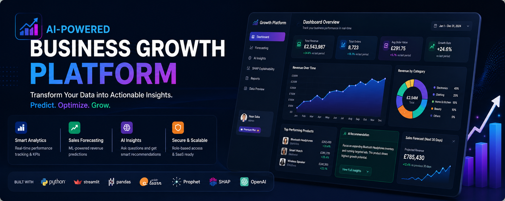
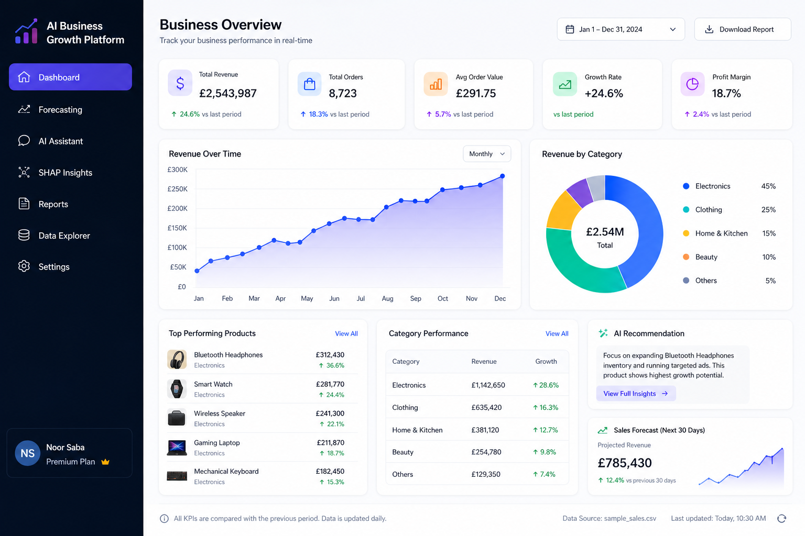
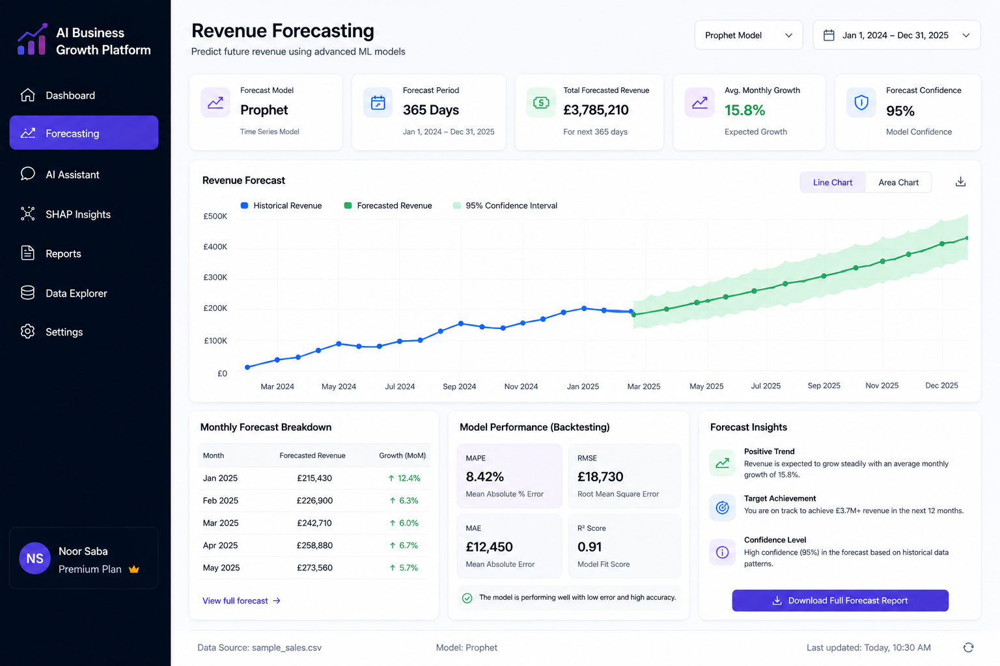
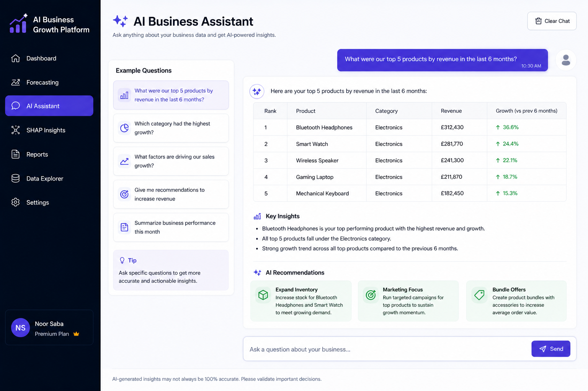

# AI-Powered Business Growth Platform

<b>Transform your business data into actionable insights using AI, forecasting, and advanced analytics.</b> 
Predict. Optimise. Grow.

---

## 🌐 Live Application
👉 https://ai-business-operations-system-b3maddq62lk7tbtlznjyd3.streamlit.app/

---

## 📸 App Preview

### 📊 Dashboard

### 📈 Forecasting

### 🤖 AI Assistant

---

## Overview

The **AI-Powered Business Growth Platform** is a full-stack, SaaS-style analytics system built to help small and medium-sized businesses make smarter, data-driven decisions.

It converts raw sales data into:

- 📊 Real-time KPIs  
- 📈 Revenue forecasts  
- 🤖 AI-driven insights  
- 🔍 Explainable machine learning outputs  
- 📄 Executive-level reports  

---

## Key Features

### 📊 Smart Dashboard
- Revenue, orders, and AOV tracking  
- Product & category performance analysis  
- Growth trend detection  

### 📈 Forecasting (Machine Learning)
- Advanced time-series forecasting using Prophet  
- Linear regression fallback for stability  
- Future revenue predictions  

### 🤖 AI Business Assistant
- Ask business questions in natural language  
- Receive clear, actionable recommendations  
- AI-generated executive summaries  

### 🔍 SHAP Explainability
- Understand **why sales are changing**  
- Feature importance insights  
- Transparent decision-making  

### 📄 Executive Reporting
- Download cleaned datasets (CSV)  
- Generate executive reports  
- AI-powered summaries  

### 💼 SaaS System
- Multi-user login system  
- Role-based access control  
- Plan-based feature access  
- Secure data isolation per user  

---

## 🧱 Tech Stack

| Layer | Tools |
|------|------|
| Frontend | Streamlit |
| Data Processing | Pandas, NumPy |
| Visualisation | Plotly |
| Machine Learning | Scikit-learn, Prophet |
| Explainability | SHAP |
| AI | OpenAI API |
| Reporting | ReportLab |
| Backend Logic | Python |
| Deployment | Streamlit Cloud |

---

## 📊 Dashboard Highlights

- 💰 Total Revenue Tracking  
- 📦 Product Performance Ranking  
- 📈 Monthly Growth Trends  
- 🔥 Top Growth Products  
- 📊 Category Contribution  

---

## 🤖 AI Capabilities

This platform leverages AI to:

- Generate **business recommendations**
- Create **executive summaries**
- Answer custom business questions
- Identify risks and growth opportunities

---

## 🧪 Machine Learning Approach

### Forecasting
- Time-series modelling using Prophet  
- Regression-based fallback model  

### Explainability
- Random Forest model  
- SHAP-based feature importance  
- Interpretable insights for business users  

---

## 💼 SaaS Monetisation Model

| Plan | Features |
|------|---------|
| **Starter** | Dashboard + Reporting |
| **Pro** | Forecasting + AI Assistant |
| **Premium** | SHAP + Advanced Analytics |

---

## 🧩 Project Structure

├── app.py
├── data/
├── user_data/
├── images/
│ └── banner.png
├── requirements.txt
└── README.md

---

## Getting Started

### 1. Clone Repository

git clone https://github.com/noorsaba5/sales-intelligence-dashboard.git
cd sales-intelligence-dashboard
### 2. Install Dependencies
pip install -r requirements.txt
### 3. Run App
streamlit run app.py

## 🔐 Environment Setup (Secrets)

## 🔐 Environment Setup (Secrets)

OPENAI_API_KEY = "your_api_key_here"

# Example user (for testing only)
[[USERS]]
username = "demo_user"
password = "your_secure_password"
role = "customer"
plan = "starter"

## 🔒 Security Notes

- Secrets are stored using Streamlit secrets  
- User data is isolated per account  
- Sensitive files are excluded via `.gitignore`  
- Production version should use hashed passwords and a database  

## 🚀 Future Improvements
🔐 Stripe subscription automation (webhooks)
🧠 Advanced forecasting (ARIMA, LSTM)
☁️ Full cloud SaaS deployment
📡 Real-time data integration
⚙️ Model optimisation & tuning
📊 Advanced analytics dashboard

## 👤 Author

<b>Noor Saba</b> 
Aspiring Data Scientist | AI & Machine Learning

## ⭐ If you found this useful

Give it a star ⭐ and feel free to connect!
